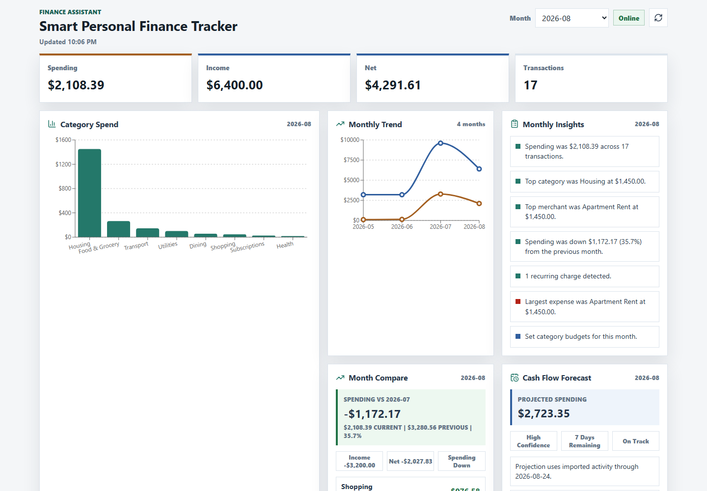
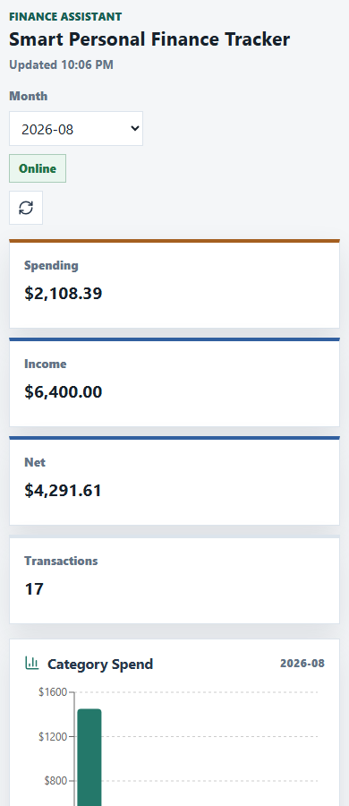
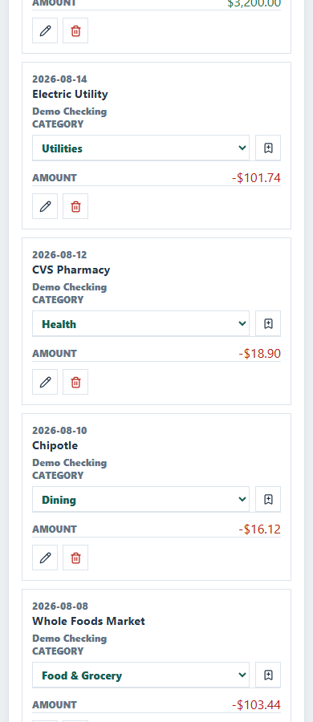

# Smart Personal Finance Tracker

A full-stack personal finance assistant for importing bank statements, cleaning
merchant data, categorizing spending, spotting unusual activity, and answering
natural-language questions from local transaction records.

The app is designed around a simple trust rule: exact totals come from
deterministic database queries, while AI Assist is optional and only suggests
categories after explicit user confirmation.

## Highlights

- React dashboard with FastAPI backend and SQLite storage
- CSV and text-based PDF statement import
- Import preview with diagnostics, duplicate estimates, and review flags
- Editable reviewed-import rows before saving
- Flexible bank CSV header mapping presets
- Merchant cleanup for noisy bank descriptors
- Explainable category suggestions with confidence and matched signals
- Optional OpenAI AI Assist for category suggestions
- Manual transaction entry, editing, deletion, and split expenses
- Account labels, account summaries, transaction search, and CSV export
- Budgets, budget recommendations, recurring charges, and bill calendar
- Anomaly detection with dismiss and restore controls
- Monthly insights, month-over-month comparison, and cash-flow forecast
- Deterministic Q&A with citations and local Q&A history
- Full local JSON backup, guarded restore, and typed reset
- Backend, frontend, and browser smoke-test GitHub Actions

## Tech Stack

- Backend: FastAPI, Pydantic, SQLite, pypdf, pytest
- Frontend: React, Vite, Recharts, lucide-react, Playwright
- Storage: local SQLite database at `data/finance.sqlite3` by default
- CI: GitHub Actions for backend tests, frontend build, and UI smoke test

## Demo Flow

1. Start the backend and frontend with the commands below.
2. Open `http://localhost:5173`.
3. Click `Load Samples` in the first-run panel or Import Statement panel.
4. Use the month selector to inspect July and August 2026.
5. Review Category Spend, Month Compare, Cash Flow Forecast, Bill Calendar,
   Import Quality, Category Review, and Anomalies.
6. Try these Q&A prompts:

```text
How much did I spend on food in July 2026?
Tell me about Amazon in July 2026
How did August 2026 spending compare to the previous month?
What bills are due in August 2026?
What budgets do you recommend for August 2026?
Why was Trader Joes categorized as Food & Grocery in July 2026?
```

The bundled sample files are synthetic and live in `data/`:

```text
data/sample_transactions.csv
data/sample_recurring_transactions.csv
```

## Screenshots

Desktop dashboard with sample data:



Mobile dashboard and transaction review:

| Dashboard | Transactions |
| --- | --- |
|  |  |

## Run Locally

Create and run the backend:

```powershell
cd backend
python -m venv ..\.venv
..\.venv\Scripts\activate
python -m pip install -r requirements.txt
uvicorn app.main:app --reload
```

Open the API docs:

```text
http://localhost:8000/docs
```

Install and run the frontend:

```powershell
cd frontend
npm install
npm run dev
```

Open the app:

```text
http://localhost:5173
```

If npm fails on Windows with `UNABLE_TO_VERIFY_LEAF_SIGNATURE`, use the Windows
certificate store before installing:

```powershell
$env:NODE_OPTIONS="--use-system-ca"
npm.cmd install
```

## Optional AI Assist

AI Assist is disabled unless `OPENAI_API_KEY` is configured on the backend.

```powershell
copy .env.example .env
# Add OPENAI_API_KEY to .env
```

By default the app uses `gpt-5-nano` for category suggestions. You can override
that with `OPENAI_CATEGORY_MODEL`.

The dashboard warns before sending any candidates to OpenAI. The sent fields are
transaction descriptions, cleaned merchant names, dates, amounts, current
categories, local suggestions, local reasons, and account labels. AI Assist does
not import data or automatically change saved transactions.

## Statement Import

CSV imports accept common bank-style headers, including:

```text
Date, Posting Date, Transaction Date, Description, Transaction Description,
Payee, Memo, Amount, Transaction Amount, Debit Amount, Credit Amount,
Debit/Credit, Card Member, Account #
```

Debit values are stored as expenses even when the export includes a minus sign
or parentheses. Unsigned amount columns can use `Type`, `Details`, or a
debit/credit column to determine direction.

For banks with unusual headers, save a CSV mapping preset from the dashboard or
`PUT /csv-mapping-presets`, then choose it during preview or direct import.

Text-based PDF uploads are supported when the statement exposes selectable text
with transaction-like rows:

```text
2026-07-02 Trader Joes -86.42
07/15 AMAZON MKTPLACE $42.10
Jul 16 Starbucks -8.75
2026-07-17, Trader Joes, Debit 54.23
```

Rows without a year use a year inferred from statement text or filename.
Scanned-image statements need OCR support before they can be imported.

Reusable parser fixtures live in `backend/tests/fixtures/statements` and cover
Chase-style checking CSV, Amex-style card CSV, Capital One-style card CSV,
generic debit/credit bank CSV, mixed bad rows, and PDF-extracted statement text.

## Data And Privacy

- Data is local by default in SQLite.
- `FINANCE_DB_PATH` can point the backend at another database file.
- Backup exports include transactions, splits, uploads, budgets, merchant rules,
  category review dismissals, CSV presets, recurring ignores, anomaly ignores,
  and Q&A history.
- Restore requires `RESTORE`; reset requires `RESET`.
- Do not commit real bank statements, account numbers, or private financial
  records.

## API Overview

Useful demo and import endpoints:

```text
POST /demo/sample-data
POST /transactions/preview
POST /transactions/preview/ai
POST /transactions/import-reviewed
POST /transactions/upload
PUT  /csv-mapping-presets
GET  /csv-mapping-presets
DELETE /csv-mapping-presets/{id}
```

Transactions, accounts, and exports:

```text
GET    /transactions?month=2026-07&category=Dining&search=coffee
POST   /transactions
PATCH  /transactions/{id}
PATCH  /transactions/{id}/category
GET    /transactions/{id}/splits
PUT    /transactions/{id}/splits
DELETE /transactions/{id}/splits
DELETE /transactions/{id}
GET    /transactions/export?month=2026-07
GET    /accounts
GET    /accounts/summary?month=2026-07
GET    /uploads
GET    /data/export
POST   /data/import
DELETE /data?confirmation=RESET
```

Analytics and review:

```text
GET  /summary?month=2026-07
GET  /insights/monthly?month=2026-07
GET  /comparisons/monthly?month=2026-08
GET  /forecast/monthly?month=2026-08
GET  /months
GET  /imports/quality?month=2026-07
GET  /categories?month=2026-07
GET  /category-options
GET  /categories/review?month=2026-07
GET  /categories/review/ignored
POST /categories/review/ai?month=2026-07
GET  /ai/categorization/status
GET  /trends
GET  /merchants?month=2026-07
GET  /expenses/largest?month=2026-07
GET  /anomalies?month=2026-07
GET  /recurring
GET  /recurring/calendar?month=2026-08
GET  /budgets?month=2026-07
GET  /budgets/recommendations?month=2026-08
POST /ask
GET  /ask/history
```

User preference endpoints:

```text
PUT    /merchant-rules
GET    /merchant-rules
DELETE /merchant-rules/{id}
PUT    /budgets
DELETE /budgets/{id}
POST   /categories/review/{transaction_id}/ignore
DELETE /categories/review/ignored/{ignore_id}
POST   /recurring/ignored
GET    /recurring/ignored
DELETE /recurring/ignored/{id}
POST   /anomalies/{id}/ignore
GET    /anomalies/ignored
DELETE /anomalies/ignored/{id}
```

## Tests

Run backend tests:

```powershell
cd backend
..\.venv\Scripts\python.exe -m pytest
```

Run the frontend production build:

```powershell
cd frontend
npm run build
```

Capture desktop/mobile visual QA screenshots and overflow checks:

```powershell
cd frontend
$env:VISUAL_QA_LOAD_SAMPLES="true"
$env:VISUAL_QA_DIR="..\docs\screenshots"
npm run visual:qa
```

Use a disposable `FINANCE_DB_PATH` on the backend when loading samples for
visual QA.

Run the browser smoke test:

```powershell
cd frontend
npx playwright install chromium
npm run test:e2e
```

The smoke test starts FastAPI and Vite against an isolated SQLite database, then
drives the browser through import, reviewed rows, category review, splits,
backup/restore, recurring controls, anomaly controls, and Q&A.

GitHub Actions runs:

- Backend Tests
- Frontend Build
- UI Smoke Test

## Project Structure

```text
smart-finance-tracker/
|-- backend/
|   |-- app/
|   |   |-- ai_categorization.py
|   |   |-- categorization.py
|   |   |-- database.py
|   |   `-- main.py
|   |-- tests/
|   |   |-- fixtures/
|   |   `-- test_api.py
|   |-- pytest.ini
|   `-- requirements.txt
|-- frontend/
|   |-- scripts/
|   |-- src/
|   |   |-- App.jsx
|   |   |-- main.jsx
|   |   `-- styles.css
|   |-- tests/
|   |-- index.html
|   |-- package-lock.json
|   |-- package.json
|   `-- playwright.config.js
|-- data/
|   |-- sample_recurring_transactions.csv
|   `-- sample_transactions.csv
|-- docs/
|   |-- screenshots/
|   `-- architecture.md
|-- .github/
|   `-- workflows/
|-- .env.example
|-- .gitignore
`-- README.md
```

## Architecture Notes

SQLite schema upgrades are tracked with a `schema_migrations` ledger and
`PRAGMA user_version`. The current baseline is
`0001 current_local_finance_schema`.

More implementation detail lives in [docs/architecture.md](docs/architecture.md).

## Future Improvements

- OCR for scanned PDF statements
- Authentication and multi-user support
- Encrypted local database option
- Deeper embedding-based retrieval over notes and statement context
- Deployment packaging and hosted demo environment
